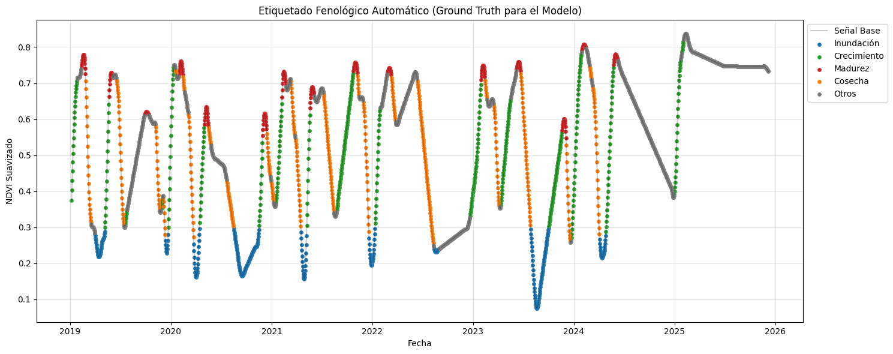

# Fenología del Cultivo de Arroz en Vietnam (2017-2025)

## Descripción del Proyecto

El proyecto tiene como objetivo desarrollar un **sistema automatizado para la detección, seguimiento y pronóstico de las etapas fenológicas del arroz** utilizando **datos satelitales históricos (2017–2025)** y técnicas de **análisis de series temporales**.

Se trabajan **índices espectrales clave**, como:
- **NDVI**: vegetación / crecimiento
- **NDWI**: agua / inundación
- **EVI**: índice de vegetación mejorado

Estos datos se limpian, suavizan y transforman para construir una **serie temporal continua**, reduciendo el ruido causado por nubes y condiciones de observación variables.

## Fuente de los Datos

Los datos fueron obtenidos de **Google Earth Engine (GEE)**, utilizando colecciones satelitales disponibles públicamente para la región de Vietnam y el periodo 2017–2025.

---

## Visualización

La imagen superior muestra un ejemplo de **NDVI suavizado** a lo largo del tiempo, con picos correspondientes a las etapas de madurez y cosecha.  

---
